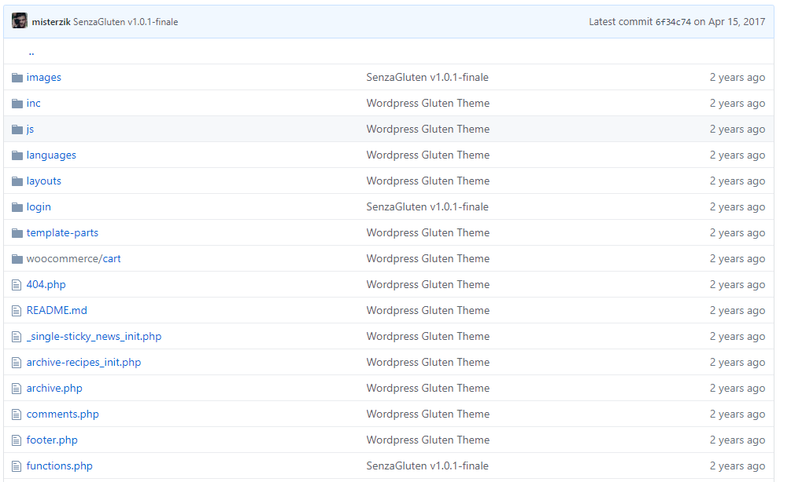

# Wordpress-theme-GlutenFREE

### Legacy Dependencies :

1) PHP
2) JAVASCRIPT
3) Wordpress

### History Snapshot:

so why snapshot's? in order to be able to make all this public, there is a lot of clean up to do specially with some of this old deprecated code and private tokens, so in order for me to do that i've to erase all commits for all our script kiddies out there.

